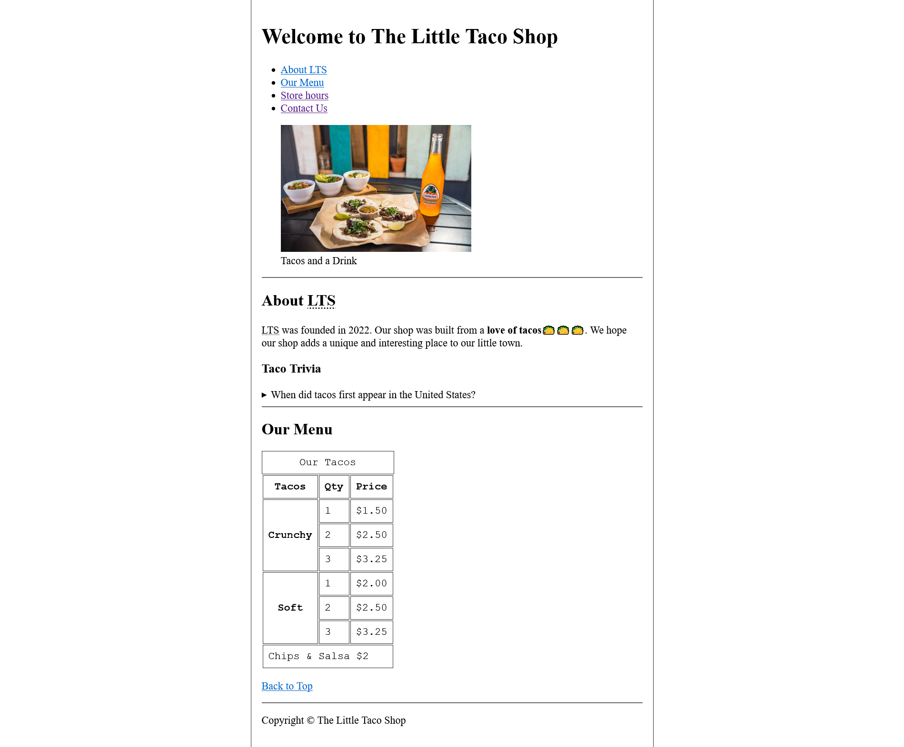
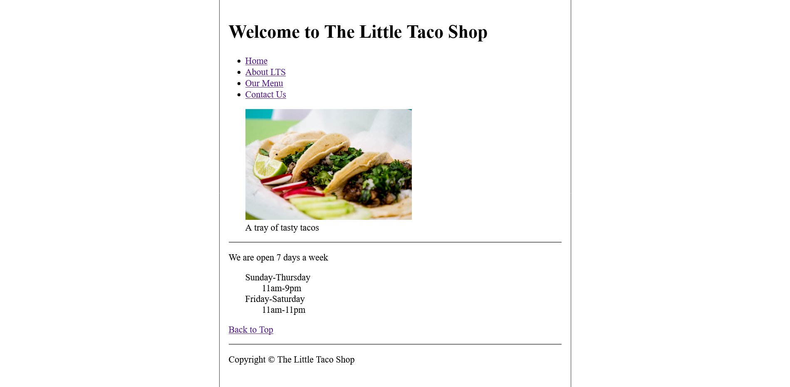
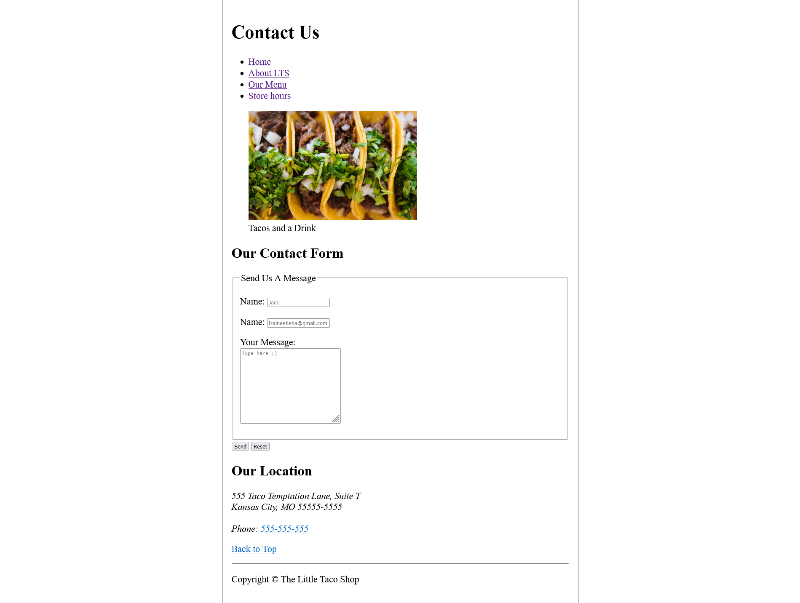

# 🌮The Little Taco Shop🌮

This project is an HTML demo for the Little Taco Shop.
It showcases a simple website structure for a fictional taco shop.

## Introduction

The Little Taco Shop HTML Demo project provides a basic example of a website for a taco shop. 
It includes multiple HTML files that showcase different sections
of the website, such as the home page, hours page and contact information.

## Screenshots

Here are some screenshots of the Little Taco Shop website:

### Home Page

### Hours Page

### Contact Page

These screenshots give you an overview of how the different pages of the Little Taco Shop website look like. 